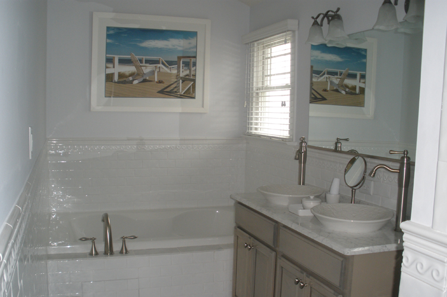

This rare single family home is a beautiful and relaxing escape for the person looking for a high end quality rental which is custom built with classical details and elegant living features. Ocean views from both the 3 front and 3 rear decks of the home and elegant interior design provide unique areas to entertain or offers a quiet escape to enjoy living at a great seaside resort. <a href="http://maps.google.com/maps?q=905+Park+Place,+Ocean+City,+NJ+08226&amp;ie=UTF8&amp;ll=39.288741,-74.558115&amp;spn=0.02325,0.036478&amp;z=14&amp;iwloc=A&amp;output=embed" rel="map" title="905 Park Place, Ocean City, NJ 08226">Click here to view a map 905 Park Place and to get directions.</a>
   

<h1>Bedroom #1 (Front-Oceanside)</h1>

This bedroom is appointed with 2 twin beds, each with a trundle bed underneath. The trundle can be pulled out and raised/locked giving you 2 large sized beds.

<h1>Bedroom #2 (Front-Bayside)</h1>

This bedroom has a king bed. The front bedrooms have flat screen TVs with DVD built in and are wall mounted. A bureau/mirror and large closet. These bedrooms also have a swivel rocker chair. Both of these rooms have large French style doors that both open onto a large 1st floor front porch with a gate to stairs descending to the front yard. 

<h1>Bedroom #3 (Back-Bayside)</h1>

This is one of <b>2 Junior Suites</b>. This suite has a king size bed, bureau/mirror and closet. This suite has French doors opening to a step out deck. This bedroom has a private full bathroom with a large shower featuring glass wall and door. A flat screen TV mounted on the wall with cable is in this room.

<h1>Bedroom #4 (Back-Oceanside)</h1>

This is the second of the <b>2 Junior suites</b>. This bedroom has a queen bed with nightstands. A large closet has a built in bureau and shelving system. A TV flat screen is on the wall. This bedroom is known for its unique private hallway to a private full bathroom. A large sitting deck with ocean views offers a quiet getaway.

<h1>Bedroom #5 (Master Suite)</h1>

A truly unique master bedroom described as peaceful, relaxing and romantic. The walls are a light ice blue like the sky. All trim work is white and the floors a calm grey. The bed is king sized flanked by nightstands. The Bed faces a fireplace with marble trim and a TV and DVD player above the mantel. A custom walk in closet is quite large. The private bathroom features a large glass enclosed shower with 3 types of different shower heads. There are double vessel sinks and a 2 person Jacuzzi tub. A private small porch features 2 rockers for an intimate conversation nook and beautiful ocean views.

<h1>Master Lounge</h1>

This private enclave features a unique custom built daybed for relaxing. There is also a twin style sleep sofa and desk in this room. A sun deck features loungers for sunbathing and some amazing beach and city views.

<h1>Living Room</h1>

The living room is located on the second floor in the front part of the house. It features large French curved doors that lead out to a second floor deck with ocean views. The central part of the room has 2 sofas and a loveseat facing a fireplace with a TV above the mantel. The living room has surround sound for watching TV, a DVD or listening to music. The living room is a wonderful place for entertaining with a high top glass table at bar height with 4 stools next to a wet bar. The wet bar contains a beverage/wine refrigerator, dishwasher, sink and plenty of cabinets for storage.

<h1>The Dining Room/Kitchen and Den</h1>

This is a separate area located on the second floor in the rear of the house. The separation of the living room and this section allows for larger gatherings around a large mahogany table which accommodates 14 people. The dining area and den also feature 3 sets of French doors which open to back decks. The den’s deck features a small eating area with beautiful ocean views. The kitchen is appointed with Stainless Steel appliances and granite countertops. The den allows for a sofa facing a large flat screen TV and encourages company while meal preparation ensues.

The Entry Level of this custom home features a large entry area of tile. A large cabana allows for use as a full bathroom  to just rinsing off of feet at the end of a beach day. A fully equipped laundry room is also in the entry area. A door also leads into the garage and a door also allows entry onto the elevator.

