908 St. Charles Place is skillfully decorated for tasteful beach living with unique furnishings and artwork. Enjoy the beach and boardwalk from the 1st floor of a stunning custom home with a view of the Atlantic ocean from the large front and back porches. <a href="http://maps.google.com/maps?f=q&source=s_q&hl=en&geocode=&q=908+St+Charles+Pl,+Ocean+City,+NJ+08226&sll=39.430124,-74.632988&sspn=0.012116,0.015922&ie=UTF8&ll=39.290601,-74.55554&spn=0.031886,0.054932&z=14&iwloc=A&output=embed" rel="map" title="908 St. Charles Place, Ocean City, NJ 08226">Click here to view a map 908 St. Charles  Place and to get directions.</a>

<h1>Front and Back Porches</h1>

<a href="images/908/DSCF1867.JPG" rel="lightbox" title="Front and Back Porches">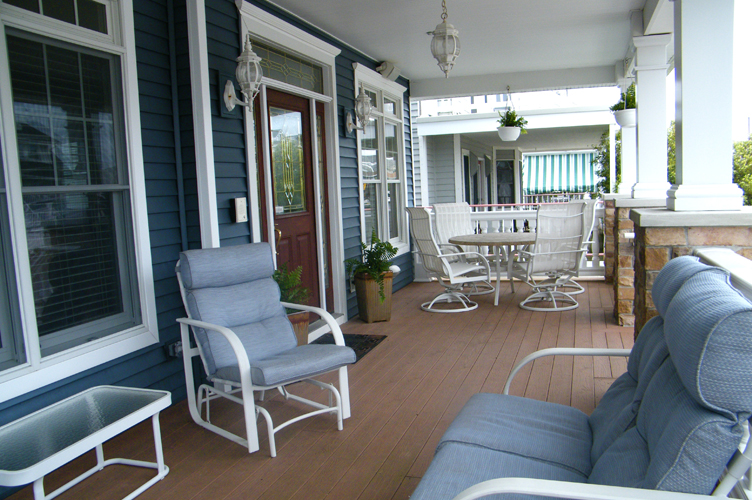</a>
<a href="images/908/DSCF1865.JPG" rel="lightbox" title="Front and Back Porches">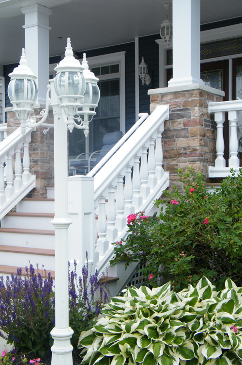</a>
<a href="images/908/DSCF1890.JPG" rel="lightbox" title="Front and Back Porches">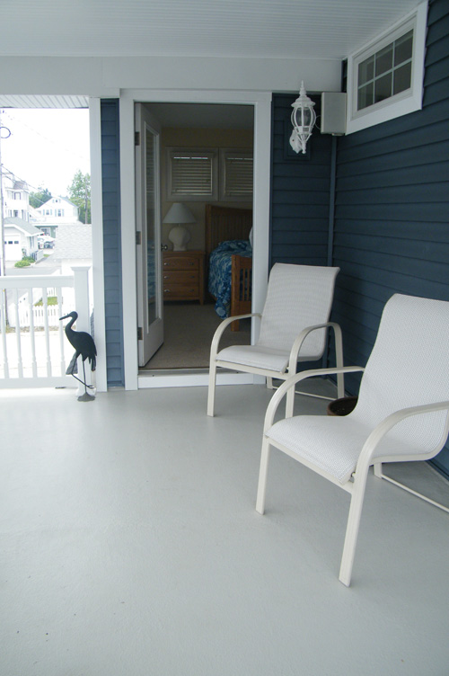</a>
<a href="images/908/DSCF1864.JPG" rel="lightbox" title="Front and Back Porches">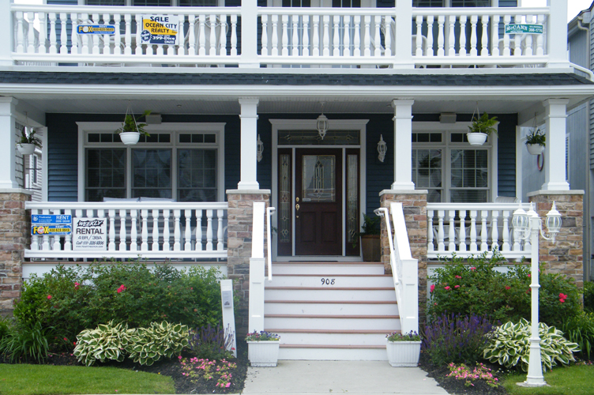</a>
<a href="images/908/DSCF1889.JPG" rel="lightbox" title="Front and Back Porches">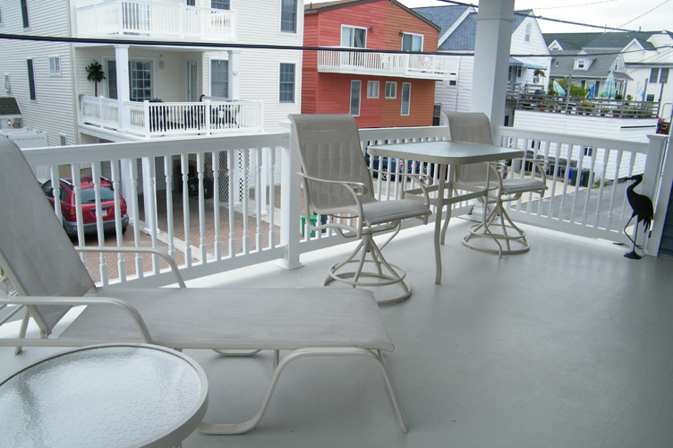</a>
<a href="images/908/DSC_3897.JPG" rel="lightbox" title="Front and Back Porches">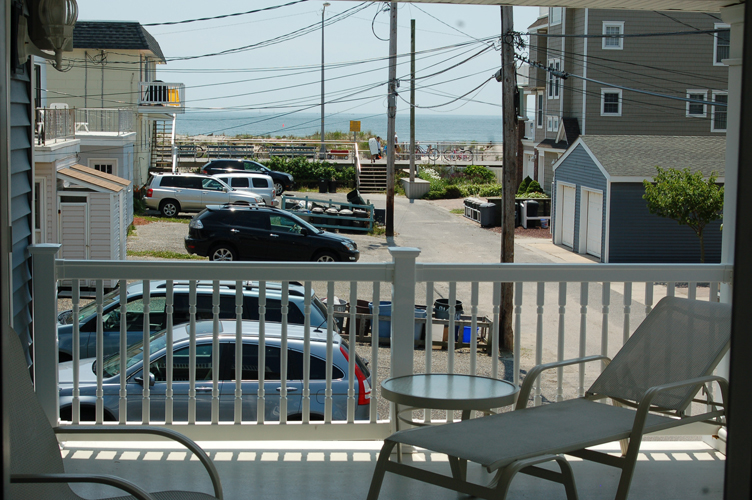</a>

Wide big porches provide ocean views. The front porch comes off the great room and the back porch is accessible from the master suite and bedroom #2.  The porches also give the guest a view to the gardens of the property.

<h1>The Great Room</h1>

<a href="images/908/DSCF1871.JPG" rel="lightbox" title="The Great Room">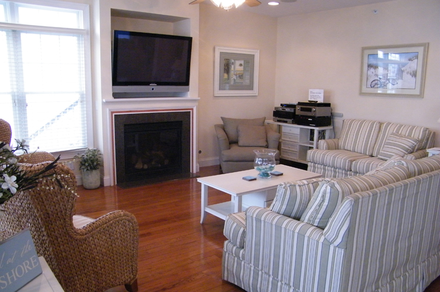</a>
<a href="images/908/DSCF1869.JPG" rel="lightbox" title="The Great Room">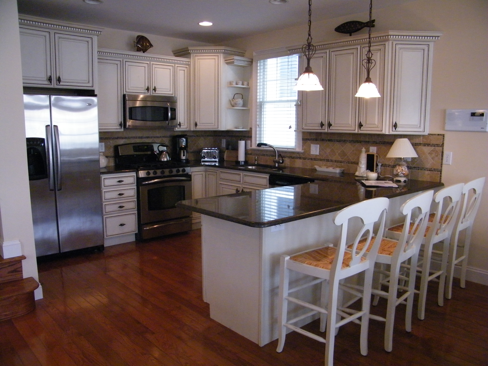</a>
<a href="images/908/DSCF1868.JPG" rel="lightbox" title="The Great Room">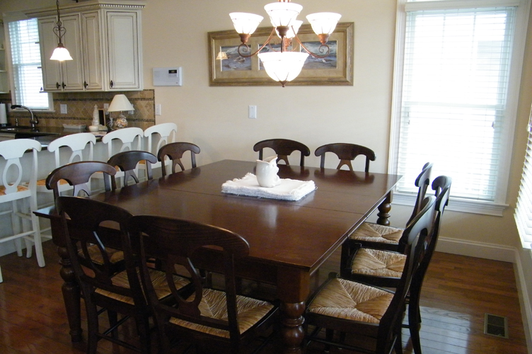</a>
<a href="images/908/DSCF1872.JPG" rel="lightbox" title="The Great Room">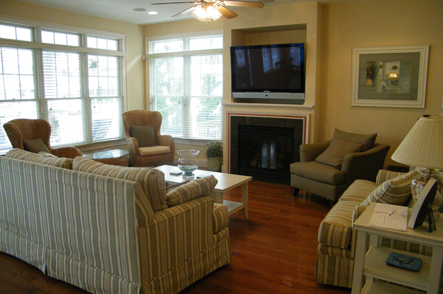</a>

The great room features the kitchen, dining room and living room. Hardwood floors are throughout the great room, entry way and hallway to bedrooms.

The kitchen features stainless steel appliances. A dual cooktop range features gas cooktop with electric oven. A wonderful combination for those who like to cook.  Granite counter with custom tile backsplash, garbage disposal and under cabinet floor vacuum system. The kitchen is well equipped with microwave, 4 slice toaster, crock pot, hand mixer, blender, and large variety of pots, casserole dishes and prep. tools. There is a kitchen island that allows seating for 4 guests.

The dining room features a large mahogany table which seats 10 guests.

The living room features a sofa, love seat, and chair for plenty of space for conversation and TV watching. The living room has a fireplace with a 50” plasma screen above the mantel and surround sound. There are 2 additional chairs and table by the large front windows. A great conversation space!

<h1>Bedroom #1</h1>

<a href="images/908/DSCF1875.JPG" rel="lightbox" title="Bedroom #1">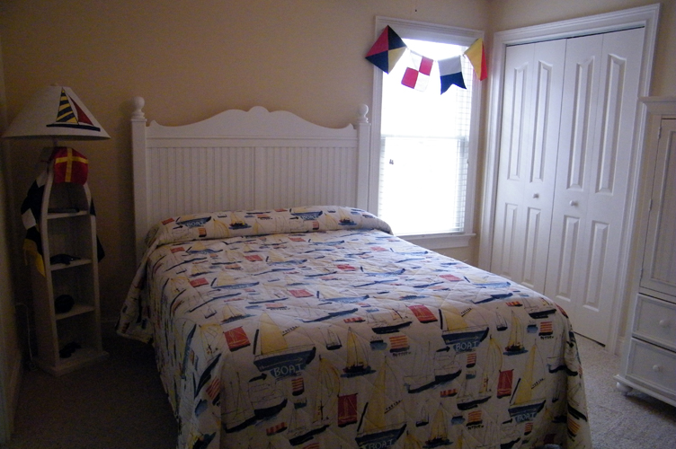</a>
<a href="images/908/DSCF1876.JPG" rel="lightbox" title="Bedroom #1">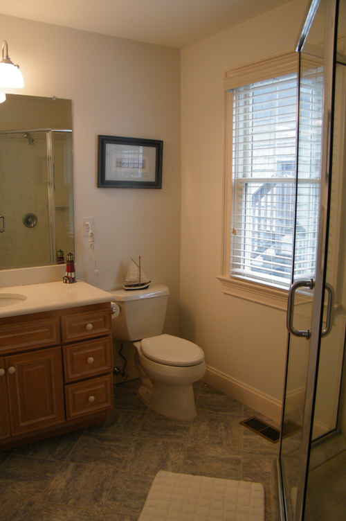</a>
<a href="images/908/DSC_3901.JPG" rel="lightbox" title="Bedroom #1">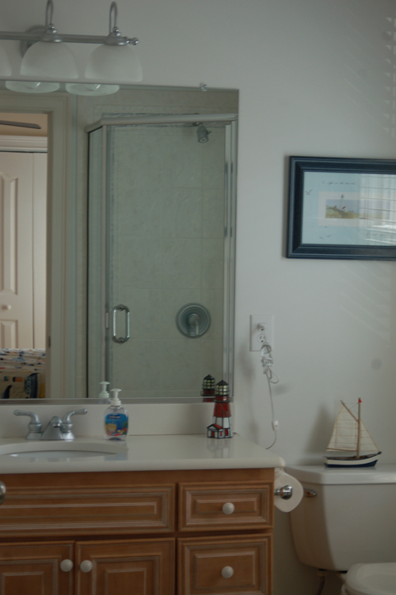</a>

Junior Master Suite features a queen size bed with full private bathroom. A TV/DVD combo is mounted on the wall and an iHome is also available in this room.

<h1>Bedroom #2</h1>

<a href="images/908/DSCF1882.JPG" rel="lightbox" title="Bedroom #1">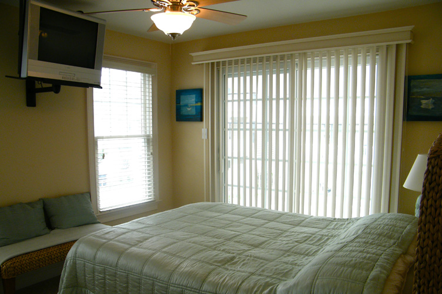</a>
<a href="images/908/DSCF1884.JPG" rel="lightbox" title="Bedroom #1">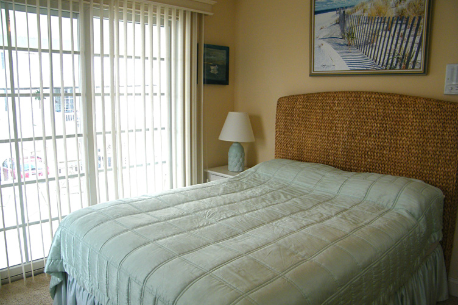</a>
<a href="images/908/DSCF1883.JPG" rel="lightbox" title="Bedroom #1">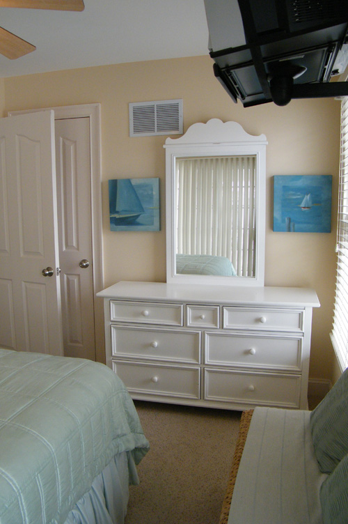</a>

The lovely back bedroom with a queen bed has an ocean view and entry onto the back porch. A TV/DVD combo is mounted on the wall.

<h1>Bedroom #3</h1>

<a href="images/908/DSCF1886.JPG" rel="lightbox" title="Bedroom #3">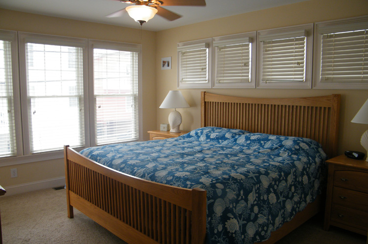</a>
<a href="images/908/DSCF1891.JPG" rel="lightbox" title="Bedroom #3">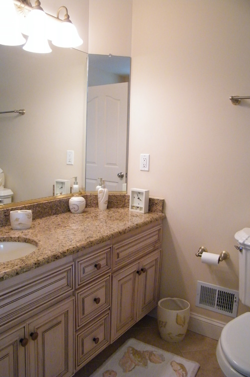</a>
<a href="images/908/DSCF1893.JPG" rel="lightbox" title="Bedroom #3">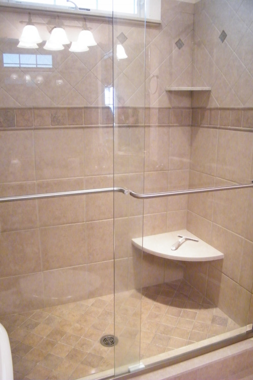</a>

Master Bedroom Suite features a king size bed and beautiful tiled full bathroom with a large glass enclosed shower. Entry onto the back porch through a full window door with lovely ocean view. A TV/DVD is mounted on wall. A large closet allows for plenty of storage and a rollaway cot is located in this closet to be used in any bedroom as needed.

<h1>Bedroom #4</h1>

<a href="images/908/DSCF1878.JPG" rel="lightbox" title="Bedroom #4">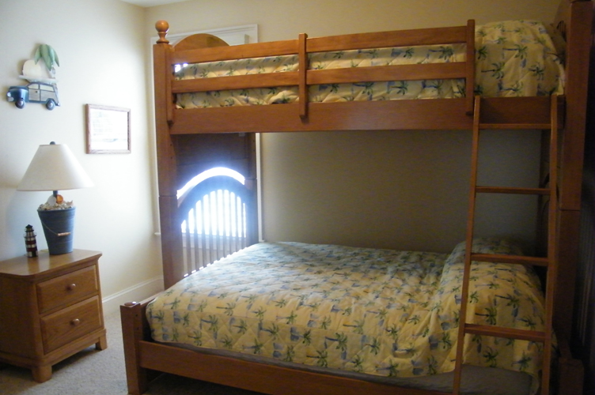</a>
<a href="images/908/DSC_3888.JPG" rel="lightbox" title="Bedroom #4">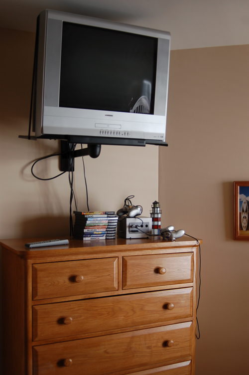</a>

This bedroom is unique with a twin bunk over a full double bed allowing for 3 guests in this room. A TV/DVD is wall mounted and a game system with some games are located in this room.

